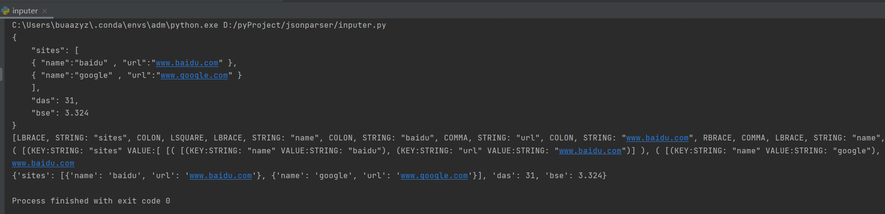

# my JSON parser

imitate a toy-language (compiler) to realize a simple JSON parser


## grammar

```
kvs  -> LBRACE pair (COMMA pair)* RBRACE

pair -> STRING COLON val

val  -> kvs
	 -> list
 	 -> atom

list -> LSQUARE (val) (COMMA val)* RSQUARE

atom -> STRING | INT |FLOAT


```


## Process

1）complete  lexer   

2）complete  parser

3）complete interpreter


## Display

